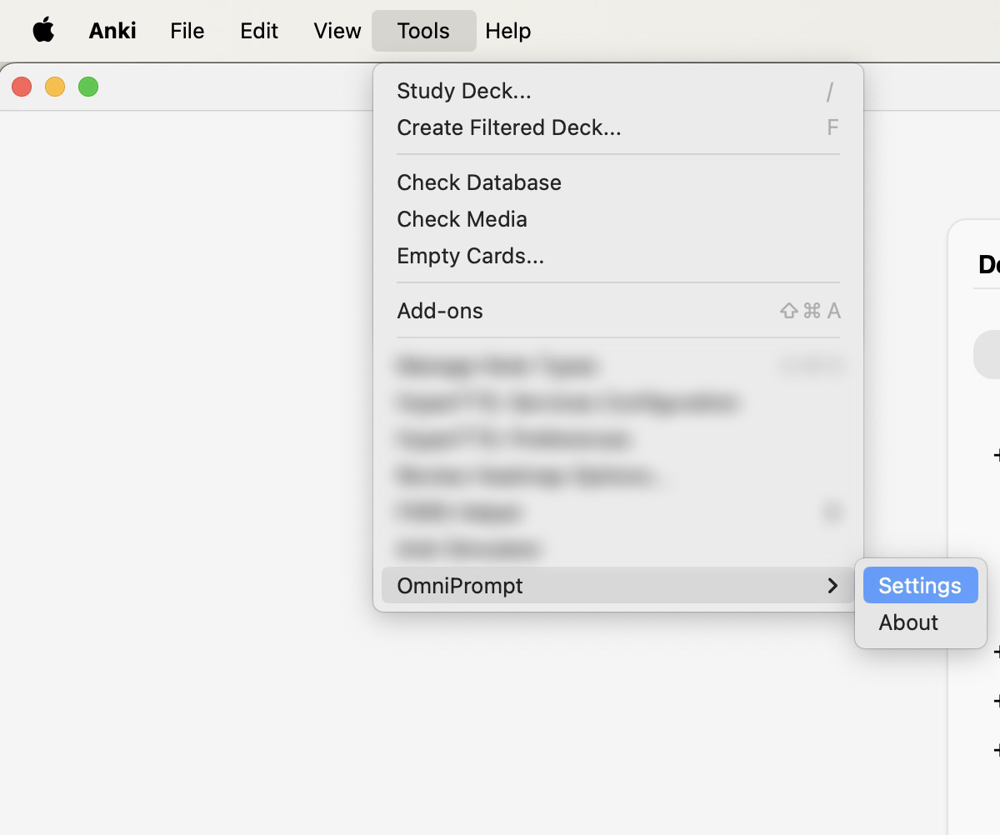
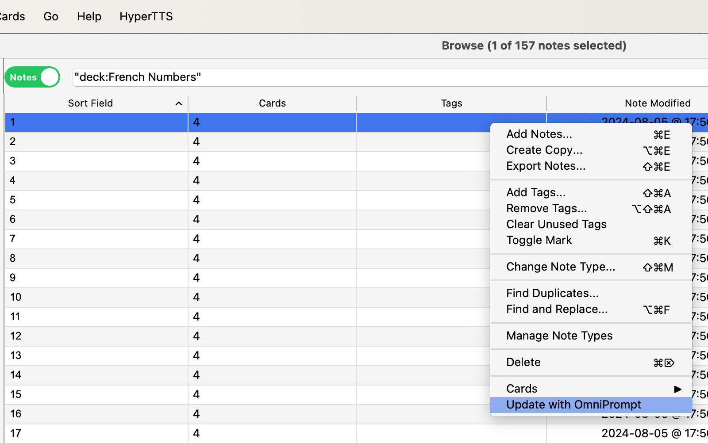
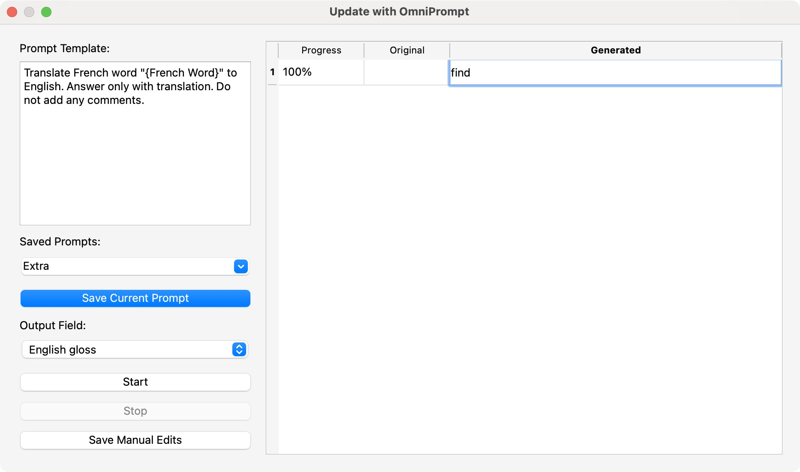

# OmniPrompt Anki 
## v1.1.1
[](https://openai.com)
[](https://deepseek.com)

**Your AI Anki Assistant!** OmniPrompt Anki is an Anki add-on that enhances your flashcards with AI-powered content generation. It integrates with **OpenAI** and **DeepSeek** models to help you improve your decks effortlessly.

## Features
✅ **AI-Powered Content** – Generate definitions, translations, explanations, synonyms, and more.
✅ **Supports OpenAI & DeepSeek** – Choose your AI provider.
✅ **Custom Prompts** – Save and reuse prompt templates with field placeholders.
✅ **Batch Processing** – Process multiple notes simultaneously.
✅ **Real-Time Progress Tracking** – Monitor AI generation progress for each note.
✅ **Flexible Field Selection** – Choose which field to update dynamically.
✅ **Auto-Save** – Generated content is automatically saved to the selected field.
✅ **Formatting Cleanup** – Use AI to clean or modify existing text formatting.

---

## User Interface

| Feature | Description | Screenshot |
|---------|------------|------------|
| **Find Add-on Settings** | Open Anki and go to **Tools → OmniPrompt-Anki → Settings** |  |
| **Settings Menu** | Configure API Key, AI model, and prompt template. |  |
| **Update with OmniPrompt** | Right-click in the Anki Browser to update notes using AI. |  |
| **Batch Processing Window** | View progress, original content, and generated AI responses. |  |

---

## Installation

### **From AnkiWeb**
1. Open Anki and go to **Tools → Add-ons → Get Add-ons**.
2. Enter the add-on code:
   ```
   1383162606
   ```
3. Restart Anki to complete the installation.

### **From Codeberg or GitHub**
#### **1️⃣ Clone the Repository**
```sh
# Codeberg
git clone https://codeberg.org/stanamosov/omniprompt-anki.git

# GitHub
git clone https://github.com/stanamosov/omniprompt-anki.git
```
#### **2️⃣ Install the Add-on**
1. Navigate to your Anki add-ons directory:
   - **macOS/Linux**: `~/.local/share/Anki2/addons21/`
   - **Windows**: `%APPDATA%\Anki2\addons21\`
2. Copy the `omniprompt-anki` folder into the add-ons directory.
3. Restart Anki.

---

## Setup
1. Open Anki and go to **Tools → OmniPrompt-Anki → Settings**.
2. Select your AI provider **(OpenAI or DeepSeek)** and enter your **API key**.
3. Choose the **AI model** (`gpt-4o`, `gpt-3.5-turbo`, `deepseek-chat`, etc.).
4. Click **Save** and start using the add-on!

---

## How It Works
1. **Select notes in the Anki Browser**.
2. **Right-click → Update with OmniPrompt**.
3. **Pick the output field where AI-generated responses will be stored.**
4. **Choose a prompt out of templates and customize it using placeholders from note fields.**
5. **Clisck Start, AI generates and saves content into the selected notes.**
6. **Edit manually if needed before finalizing, click Save Manual Edits to save your edits.**
7. **Enjoy enhanced flashcards!**

---

## Examples of Use

### **Word Definition & Translation**  
**Prompt Example:**  
```plaintext
Translate the word "{Front}" into French. Provide a detailed explanation and example sentences.
```
**Use Case:** Useful for bilingual vocabulary decks.

### **Grammar Explanation for Cloze Sentences**  
**Prompt Example:**  
```plaintext
Analyze the grammar of this sentence: "{Cloze}". Explain the function of each word.
```
**Use Case:** Great for Cloze Deletion decks.

### **Verb Conjugations**  
**Prompt Example:**  
```plaintext
Provide conjugation tables for the verb "{Front}" in past, present, and future tenses.
```
**Use Case:** Ideal for memorizing verb forms.

### **Sentence Generation**  
**Prompt Example:**  
```plaintext
Generate 2 example sentences for language learners on the level B1-B2 using "{Front}".
```
**Use Case:** Expands usage knowledge for learners.

### **Phonetics & Pronunciation**  
**Prompt Example:**  
```plaintext
Provide an IPA transcription and pronunciation tips for the word "{Front}".
```
**Use Case:** Helps with speech clarity and accents.

---

## Customizing Prompts with Note Fields
Use **any field** from your note type in prompts. Field names are **case-sensitive**. You can use **multiple fields** in your prompt and even use your **Output field** for input - it makes possible change formatting of existing fields!

### **Example Using Multiple Fields**
  **PROMPT**:  
  ```
  Generate a detailed explanation for "{Japanese Word}". Include this example: "{Sentence}".
  ```

---

## Logging & Debugging

OmniPrompt-Anki maintains a log file (**omnPrompt-anki.log**) inside the add-ons folder to track API requests, responses, and potential errors. This helps with troubleshooting issues like API connection failures, timeouts, or unexpected responses. The log file is capped at **5MB**, with up to **two backups** to prevent excessive disk usage.  

To make debugging easier, the add-on includes a **View Log** button in the **Settings** menu. Simply open **Tools → OmniPrompt → Settings** and click **View Log** to inspect recent activity and diagnose issues quickly.

---

## 🤝 Contributing

### **How to Contribute**
1. **Fork the repository** on [Codeberg](https://codeberg.org/stanamosov/omniprompt-anki) or [GitHub](https://github.com/stanamosov/omniprompt-anki).
2. **Create a new branch** (`feature-new-functionality`).
3. **Make your changes** and **test in Anki**.
4. **Submit a pull request** with a clear description.

### **Ways to Help**
- **Bug reports & feature requests**: Open an issue on [Codeberg](https://codeberg.org/stanamosov/omniprompt-anki) or [GitHub](https://github.com/stanamosov/omniprompt-anki).
- **Improve documentation**.
- **Optimize code & performance**.

---

## 🛠️ Roadmap
### **✅ Completed**
- [x] Custom prompts & field selection.
- [x] OpenAI & DeepSeek integration.
- [x] UI improvements & auto-save feature.

### **🚀 Planned**
- [ ] Support for more AI models.
- [ ] Enhanced UI for multi-note processing.

---

## 📜 License
This project is licensed under the [**MIT License**](docs/LICENSE). Feel free to use, modify, and distribute it with attribution.

---

## ❤️ Support & Feedback
- Found a bug? Open an **issue** on [Codeberg](https://codeberg.org/stanamosov/omniprompt-anki) or [GitHub](https://github.com/stanamosov/omniprompt-anki).
- Have suggestions? **We’d love to hear your feedback!**
- Want to contribute? See the **Contributing** section.

OmniPrompt-Anki is **completely free** and open-source, created to help learners enhance their flashcards with AI-powered content. If you find this add-on useful, you can support its development by **leaving a positive review on AnkiWeb**. Your feedback helps more users discover the add-on and encourages further improvements.  

👉 [**Rate add-on on AnkiWeb**](https://ankiweb.net/shared/review/1383162606)  

Thank you for your support! 🚀  

---

Enjoy **OmniPrompt Anki** and make your learning smarter!
