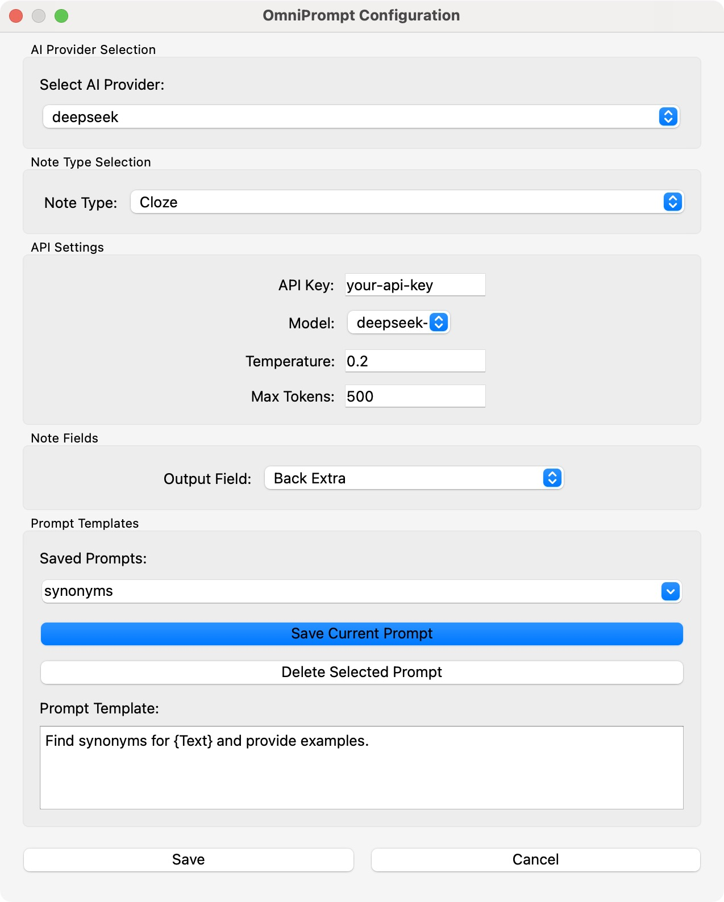
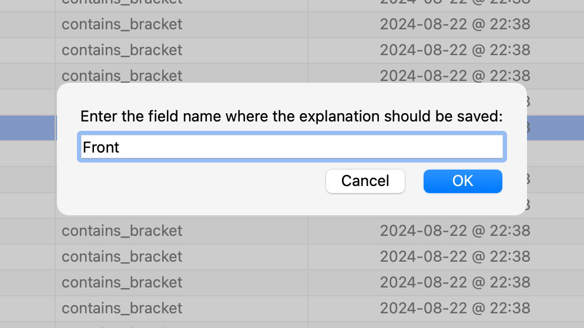
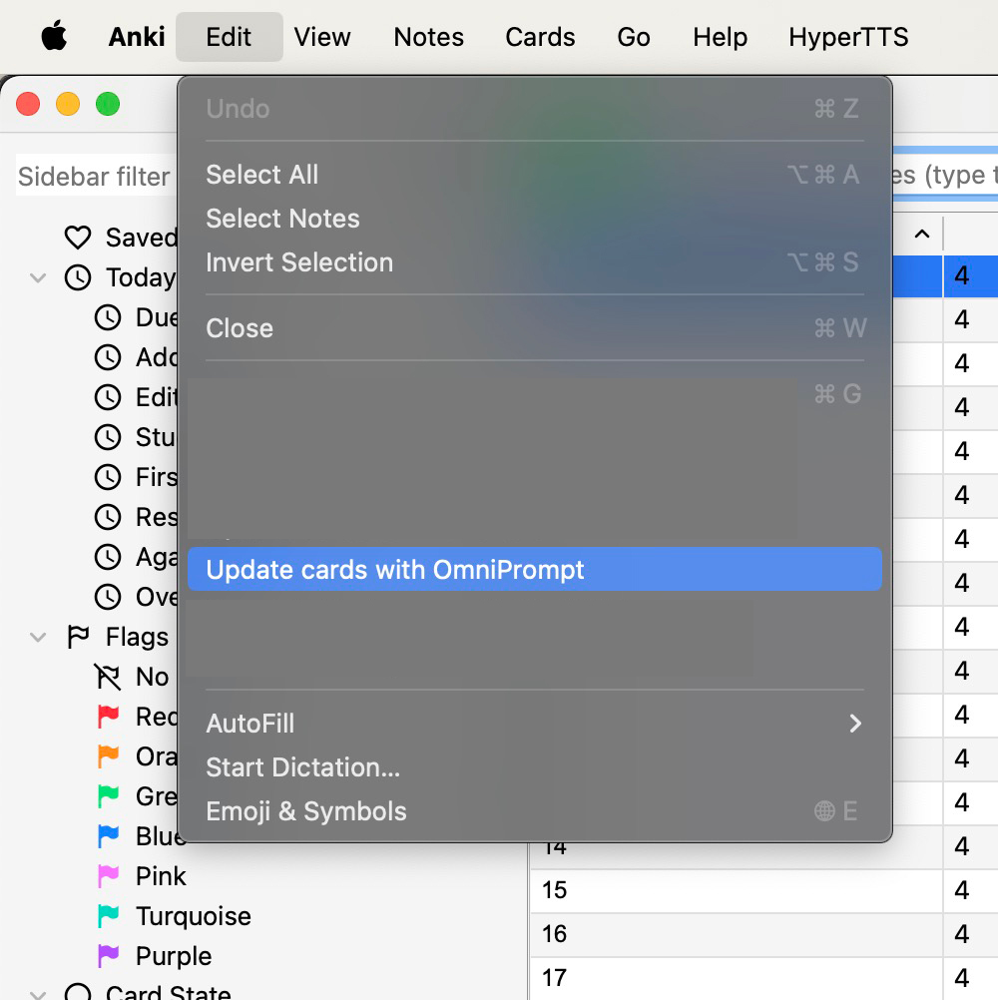

# OmniPrompt Anki 🚀  

**OmniPrompt Anki** is an Anki add-on that enhances your flashcards by generating AI-powered fields. It integrates with LLM models to provide **detailed grammar explanations, translations, definitions**, whatever you want to add to your deck!

## Features
✅ **AI-Powered Explanations** – Uses LLM models to generate your card field content.  
✅ **Custom Prompts** – Customize your prompts through user interface.  
✅ **Batch Processing** – Process multiple notes at once.  
✅ **Progress Tracking** – A progress bar shows real-time updates for batch processing.  
✅ **Field Selection** – Choose which field to update **before running**.  
✅ **Use Any Note Field in Prompt** – Dynamically insert note fields into the prompt.  

---

## User Interface

To help you understand how **OmniPrompt-Anki** works, here are some key interface elements.

| Feature | Description | Screenshot |
|---------|------------|------------|
| **1️⃣ Settings Menu** | Configure API Key, GPT model, and prompt template. Select the note type before choosing fields. |  |
| **2️⃣ Selecting the Explanation Field** | Before updating, you must confirm which field will be overwritten. **Warning:** This action will replace existing content in the selected field. |  |
| **3️⃣ Running OmniPrompt in the Anki Browser** | Select notes and click **"Update cards with OmniPrompt"** in the **Edit menu**. The progress bar will indicate real-time updates. |  |

---

## Installation

### **From AnkiWeb**
1. Open Anki and go to **Tools → Add-ons → Get Add-ons**.
2. Enter the add-on code (to be provided when published on AnkiWeb).
3. Restart Anki to complete the installation.

### **From Codeberg or GitHub**
#### **1️⃣ Clone the Repository**
```sh
git clone https://codeberg.org/stanamosov/omniprompt-anki.git
# or from Github
git clone https://github.com/stanamosov/omniprompt-anki.git
```
#### **2️⃣ Install the Add-on**
1. Navigate to your Anki add-ons directory:
   - **macOS/Linux**: `~/.local/share/Anki2/addons21/`
   - **Windows**: `%APPDATA%\Anki2\addons21\`
2. Copy the `omniprompt-anki` folder into the add-ons directory.
3. Restart Anki.

---

## Setup
1. Open Anki and go to **Tools → Add-ons → OmniPrompt-Anki → Config**.
2. Enter your **OpenAI API key**.
3. Choose the **GPT model** (`gpt-4o`, `gpt-3.5-turbo`, etc.).
4.  **Select a note type** before choosing the fields.  
   🔹 *By default, the first note type in your collection is selected.*
5. **Set the field where AI-generated explanations should be saved.**
6. **Edit the prompt template to include any field from the selected note type.** *(See examples below)*
7. Click **Save** and start using the add-on!

---

## How It Works
1. **Select notes in the Anki Browser**.
2. **Click “Update cards with OmniPrompt”** in the **Edit menu**.
3. **Confirm which field will be overwritten.**  
   🚨 **Warning:** All existing data in the selected field **will be replaced** with AI-generated content.
4. The add-on **sends a request to OpenAI** with the configured prompt.
5. AI-generated content **is saved in the selected field**.
6. A **confirmation message** shows how many notes were updated.

---

## Customizing the Prompt with Note Fields
You can use **any field from your selected note type** inside the prompt. Field names are **case sensitive**!

### **Example Prompt Using Note Fields**
  **PROMPT**: Generate a detailed explanation for this word: {Front}. Include examples and a grammar breakdown.

### **Using Multiple Fields**
  **PROMPT**: Generate a detailed explanation for this japanese word: {Japanese Word}. Include this example: "{Sentence}" in explanation.
This dynamically pulls **both Japanese Word and Sentence fields** into the AI request.

### **🚨 Warning: Field Overwrite**
Before running, the add-on will **ask you to confirm** the field where the AI-generated content will be saved.  
**All existing content in this field will be replaced.**

---

## Logging
This add-on maintains a log file (**omnPrompt-anki.log**) inside the add-ons folder.  
This log captures API requests, responses, and errors for debugging purposes. The log file is limited to **5MB**, and up to **two backups** are maintained to prevent excessive disk usage. If you encounter issues, check the log file to diagnose API failures or connection errors.

---

## 🤝 Contributing
We welcome contributions! 🛠️

### **How to Contribute**
1. **Fork the repository** on [Codeberg](https://codeberg.org/stanamosov/omniprompt-anki) or [GitHub](https://github.com/stanamosov/omniprompt-anki).
2. **Create a new branch** (`feature-new-functionality`).
3. **Make your changes** and **test in Anki**.
4. **Submit a pull request** with a clear description.

### **Ways to Help**
- **Bug reports & feature requests**: Open an issue on [Codeberg](https://codeberg.org/stanamosov/omniprompt-anki) or [GitHub](https://github.com/stanamosov/omniprompt-anki).
- **Code improvements**: Help optimize or add new features.
- **Documentation**: Improve instructions.

---
## 🛠️ Roadmap
### **✅ Completed**
- [x] Selectable note fields in the prompt  

### **🚀 Planned Features** 
- [ ] **Customization UI** – More user-friendly settings configuration.  
- [ ] **More AI Models** – Add support for DeepeSeek and other LLMs.  

---

## 📜 License
This project is licensed under the [**MIT License**](docs/LICENSE).  
You are free to use, modify, and distribute the code with attribution.

---

## ❤️ Support & Feedback
- Found a bug? Open an **issue** on [Codeberg](https://codeberg.org/stanamosov/omniprompt-anki) or [GitHub](https://github.com/stanamosov/omniprompt-anki).
- Have suggestions? **We’d love to hear your feedback!**  
- Want to contribute? Check out the **Contributing** section.

Enjoy smarter studying with **OmniPrompt Anki Plugin**! 🚀

